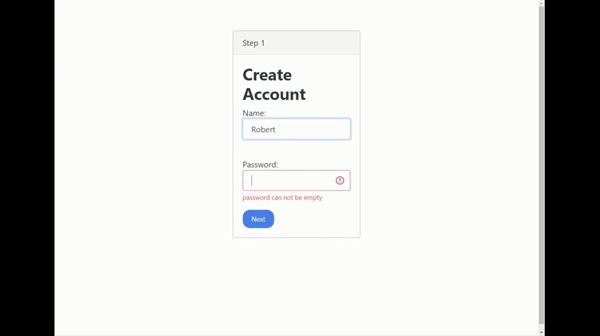

# Multi-Step form

This is my coding chanllenge exercise which is made by Colt Steele [link](https://www.youtube.com/watch?v=qGwR_DSSnuQ&t=169s)

## Features
- 3-step form
- validation and error message on every input field
- can go to previous step
- nice looking

## Preview

## Demo
[demo](https://kalpaswang.github.io/Multi-Step-Form/)